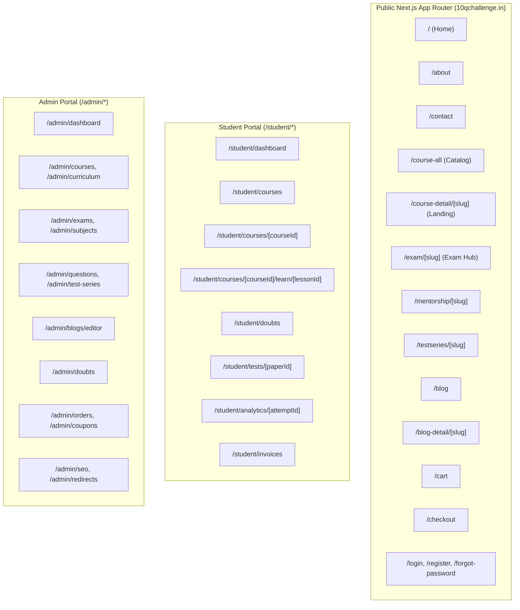

# 10 - New Site Structure & Information Architecture

## 1. Information Architecture Overview
The new **10Q Challenge** platform architecture separates concerns into three distinct logical areas built with Next.js App Router and ASP.NET Core Web API:
1. **Public Marketing & Growth Platform (`(public)`)**: High-performance, SSR/SSG-driven marketing pages, exam landing hubs, course discovery catalogs, course landing pages, mentorship showcases, and blog publication center.
2. **Student Learning Portal (`(student)`)**: Single-page application experience for enrolled students featuring video streaming, note reading, real-time doubt raising, test engine, and invoice viewing.
3. **Administrative Operations CMS (`admin`)**: Secure, enterprise-grade content management, curriculum builder, test paper builder, doubt resolution desk, and SEO management panel.

---

## 2. Dynamic Route Configuration & Metadata Mapping
- `/course-detail/[slug]`: Dynamically fetches complete course landing content, curriculum outline, faculty profiles, and SEO metadata via SSR.
- `/blog-detail/[slug]`: Dynamically fetches rich HTML content, related posts, category tags, author card, and JSON-LD schema via SSR.
- `/exam/[slug]`: Dynamically aggregates exam syllabus, active courses, test series, mentorship programs, and exam-specific FAQs.
- `/mentorship/[slug]`: Dedicated mentorship program landing with mentor details, scheduling, perks, and direct enrollment flow.
