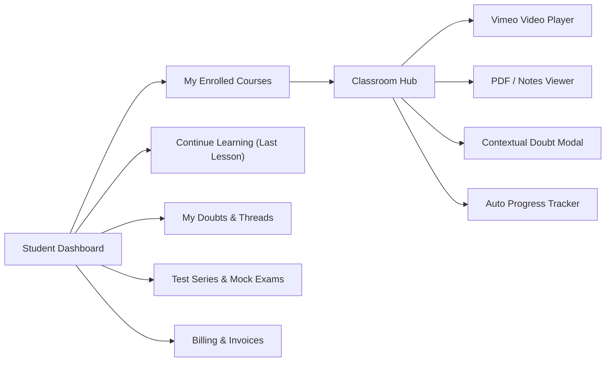

# 11 - Student Panel Architecture & Learning Portal

## 1. Student Portal Overview
The Student Learning Portal is an authenticated workspace designed for seamless course consumption, doubt resolution, test taking, and progress tracking.

---

## 2. Core Functional Modules

### 2.1 Dashboard & Continue Learning
- **Hero Card**: Displays the student's most recently accessed course with a prominent "Resume Learning" CTA pointing directly to the last active lesson ID and timestamp.
- **Progress Metrics**: Overall course completion percentage, lectures watched, PDFs studied, and test series average percentile.
- **Recent Announcements**: Course-specific notices broadcast by admins/instructors.

### 2.2 Course Learning Classroom (`/student/courses/[courseId]`)
- **Curriculum Sidebar**:
  - Tree structure: Subject -> Chapter -> Lesson.
  - Distinct icons for Video Lessons, Notes/PDFs, Practice Quizzes, and Live Sessions.
  - Completion checkmarks indicating lesson status.
- **Video Player Panel**:
  - High-definition Vimeo embedded player with autoplay disabled until user interaction.
  - Auto-record progress on video completion (`POST /api/v1/student/progress/complete`).
- **PDF / Study Material Reader**:
  - Embedded, responsive PDF viewer supporting zoom, download, and fullscreen.
- **Contextual Doubt Button**:
  - Students can raise a doubt attached to the exact video/document with one click.

### 2.3 Computer-Based Test (CBT) Engine (`/student/tests/[paperId]`)
- **Pre-Test Instructions**: Exam rules, marking scheme (+3, -1, 0), time limits, and bonus question rules.
- **Test Interface**:
  - Timer countdown with automatic submission upon expiry.
  - Question palette with state indicators (Answered, Not Answered, Marked for Review, Not Visited).
  - Single Choice MCQ selector & Numerical input keypad with decimal support.
- **Post-Test Analytics**:
  - Instant scorecard: Total Score, Correct, Incorrect, Unattempted.
  - Subject-wise and Topic-wise accuracy breakdown.
  - Detailed step-by-step solutions with LaTeX math rendering via KaTeX.

### 2.4 Doubts & Invoices
- **Doubt Management**: Filter by Open / Answered / Closed status; live conversation thread with instructor responses.
- **Invoices**: View GST-compliant invoices with line-item course prices, coupon discounts, tax breakdown, and printable PDF export.
