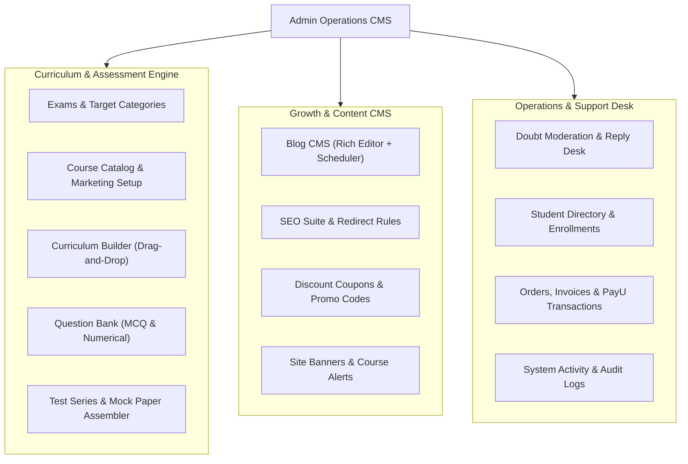

# 12 - Admin Panel Architecture & CMS Platform

## 1. Enterprise Admin Experience Overview
The new Admin Panel provides a modern SaaS content management system with role-based access control (RBAC), searchable data tables, drawer/modal workflows, rich text editing, and granular SEO management.

---

## 2. Main Navigation & Functional Modules

### 2.1 Course Builder & Curriculum Manager
- **Course Metadata**: Title, Slug, Pricing, Expiry, Discount %, Thumbnails, Hero Video Trailer, Target Exam Category.
- **Section Block Builder**: Structured marketing sections (What You'll Learn, Key Features, Faculty Bios, Testimonials, FAQ Accordion).
- **Curriculum Tree Builder**:
  - Reorderable Subjects -> Chapters -> Lessons.
  - Quick-attach Vimeo Video IDs with duration detection and thumbnail fetch.
  - Quick-attach PDF notes and study resources.

### 2.2 Question Bank & Test Series Assembler
- **Question Editor**: LaTeX Math equation support, Single Choice options with explanation, Numerical range tolerance.
- **Mock Paper Configurator**:
  - Exam timing, positive marks, negative penalty, bonus section rules.
  - Drag-and-drop question ordering and section assignment (Physics, Chemistry, Math, English, Logical Reasoning).

### 2.3 Blog CMS & Rich Authoring
- **Editor**: Modern Block-based WYSIWYG editor supporting Headings, Images with SEO captions, Callout boxes, Tables, Embedded Videos, Code snippets, and FAQ schema.
- **Publishing Lifecycle**: Draft -> Scheduled -> Published -> Archived with automated Next.js revalidation (`revalidatePath`).

### 2.4 Support, Billing & Operations Desk
- **Doubt Clearance Console**: Filter unresolved student questions by subject/lesson; rich Markdown reply composer with file attachment support.
- **Order & Transaction Hub**: Real-time PayU webhook logs, payment reconciliation, manual enrollment grants, invoice downloads.
