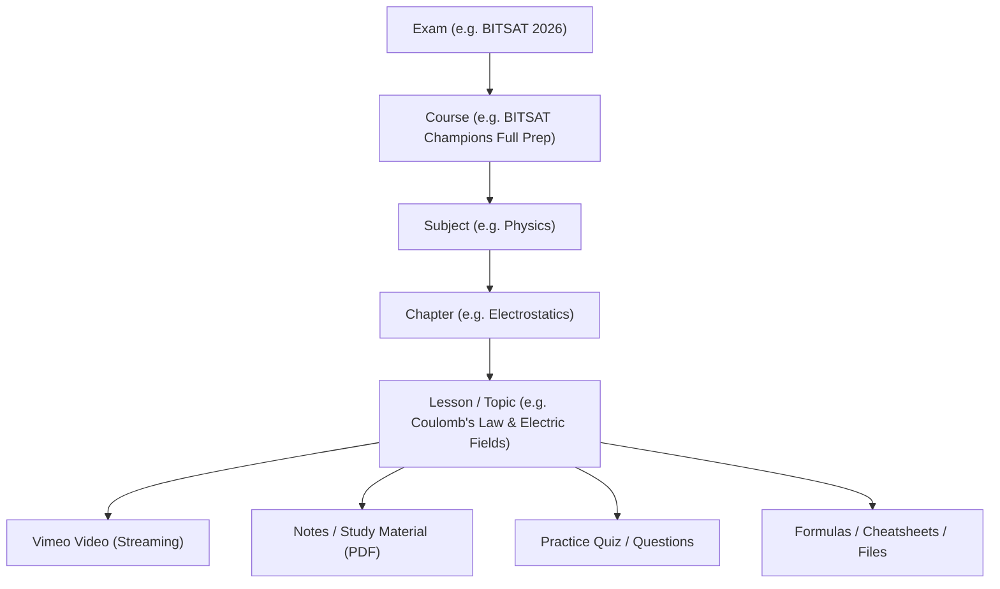

# 13 - Course Content & Curriculum Hierarchy Structure

## 1. Domain Hierarchy

---

## 2. Separation of Marketing Content vs Curriculum Structure

To ensure maximum performance, SEO optimization, and clean data modeling:

### 2.1 Marketing Content (Public Domain)
Managed as structured modular blocks rendered on `/course-detail/[slug]`:
- **Course Header**: Title, Slug, Exam Category, Short Description, Pricing, Validity Period, Enrolled Count, Rating/Badge, Trailer Video.
- **Hero & Highlights**: High-impact bullet points and key guarantees.
- **Target Audience / Prerequisites**: Who this course is engineered for.
- **Faculty / Instructors**: Name, Designation, Photo, Credentials, Bio.
- **Structured FAQs**: Question and Answer pairs configured for SEO FAQPage schema.
- **Student Testimonials**: Verified student feedback, college placements (e.g. BITS Pilani, Goa, Hyderabad).

### 2.2 Curriculum Structure (Private LMS Domain)
Protected by server-side authorization middleware (`[Authorize]` / Valid Enrollment required):
- Unlimited nested structure: Exam -> Course -> Subject -> Chapter -> Lesson.
- **Lesson Metadata**:
  - `LessonType`: Video, Document, Quiz, Live Stream.
  - `VimeoVideoId`: Secure Vimeo identifier.
  - `DurationSeconds`: Video runtime for progress calculation.
  - `DocumentUrl`: Secure path to PDF notes.
  - `SortOrder`: Drag-and-drop sequencing.
  - `IsFreePreview`: Allows un-enrolled students to preview specific sample lessons.
