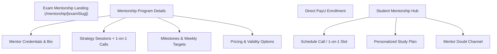

# 14 - Mentorship System & Product Structure

## 1. Mentorship Overview
Mentorship is a premium high-touch educational offering within the 10Q Challenge ecosystem where top rankers and experienced faculty mentor students 1-on-1 and in small cohorts through personalized strategy, test analysis, and doubt clearance.

---

## 2. Program Data Model & CMS Controls
Admin can create and customize mentorship programs with:
- **Target Exam**: (BITSAT, JEE Main, JEE Advanced, COMEDK, MET, etc.)
- **Program Title & Slug**: (e.g. `/mentorship/bitsat-elite-mentorship`)
- **Mentor Profiles**: Photo, Alma Mater (e.g., BITS Pilani CS, IIT Bombay), Rank, Description.
- **Deliverables**: Number of 1-on-1 strategy calls, weekly schedule reviews, WhatsApp support access, custom test strategy.
- **Pricing & Validity**: Discounted price, duration in months or exam validity date.
- **SEO & Schema**: Mentorship SEO title, meta description, and Service / Course structured data.
