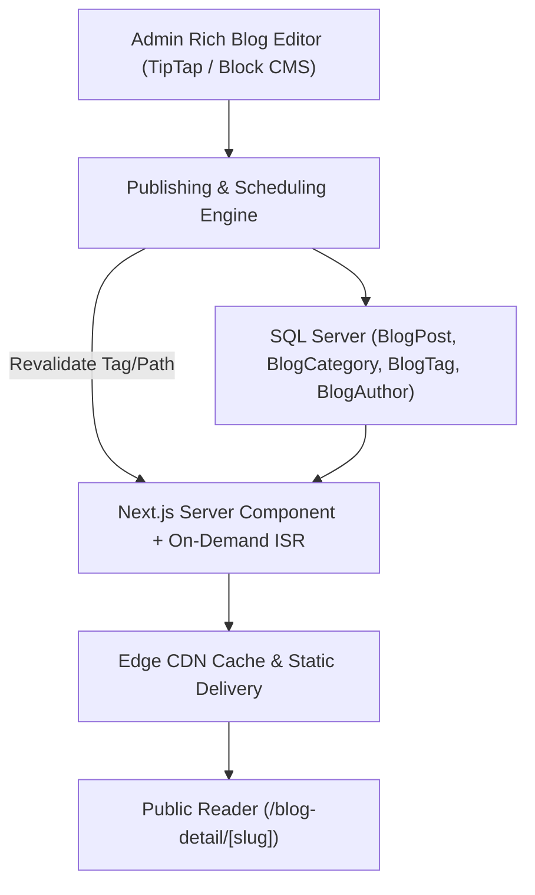

# 15 - Blog CMS Architecture & Content Migration Engine

## 1. High-Performance Blog Architecture
The new Blog CMS is designed for editorial efficiency, instant revalidation, and SEO authority.

---

## 2. Full Content Migration Protocol (100% Fidelity)
- **Database Extraction**: Extract all rows from legacy `tblEL_MasterBlog`.
- **Slug Exact Matching**: Every post retains its exact `BlogSlug` without modification to preserve indexed rankings.
- **Image Media Pipeline**:
  - Legacy blog images in `wwwroot/site/assets/img/blog/` will be migrated to the new web assets storage.
  - Automatic WebP conversion with fallback support.
  - Image dimensions and `alt` tags preserved from `AltTag_Description_Small` and `AltTag_Description_Large`.
- **HTML Content Integrity**: Preserve all existing article markup, headings (`<h2>`, `<h3>`), bullet points, tables, and internal hyperlinks.

---

## 3. Blog Publishing Lifecycle
- **Status Options**: `Draft`, `Scheduled` (with automated cron publish), `Published`, `Archived`.
- **Features**:
  - Category and multi-tag association.
  - Author attribution with photo, bio, and social links.
  - Estimated reading time calculation.
  - Automatic Table of Contents generation from `<h2>` and `<h3>` headings.
  - Social share links (WhatsApp, Telegram, Twitter/X, LinkedIn).
  - Dynamic JSON-LD `Article` and `BreadcrumbList` schema generation.
