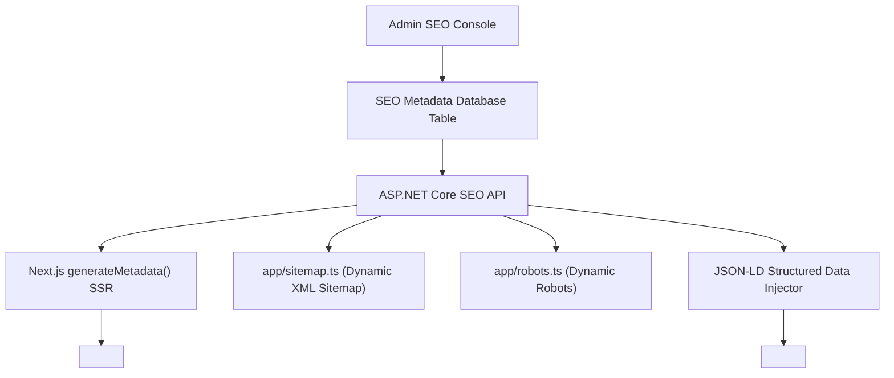

# 16 - SEO CMS Architecture & Structured Data Engine

## 1. Technical SEO Framework Overview
The SEO CMS engine ensures technical SEO control across every indexable entity on the website.



---

## 2. Granular SEO Controls per Entity
Every entity (Page, Exam, Course, Mentorship, Blog Post) contains editable SEO controls:
1. **SEO Title**: Max 60 characters with preview counter.
2. **Meta Description**: Max 160 characters with snippet preview.
3. **Canonical URL**: Custom override or default auto-generated absolute URL.
4. **Robots Directives**: `index, follow`, `noindex, nofollow`, `noimageindex`.
5. **Open Graph (OG)**: `og:title`, `og:description`, `og:image` (1200x630), `og:type` (`website`, `article`, `product`).
6. **Twitter / X Card**: `summary_large_image`, `twitter:title`, `twitter:description`, `twitter:image`.
7. **Breadcrumb Titles**: Custom label for breadcrumb hierarchies.

---

## 3. Automated Structured Data (Schema.org) Engines

### 3.1 Course Schema (`schema.org/Course`)
```json
{
  "@context": "https://schema.org",
  "@type": "Course",
  "name": "BITSAT 2026 Champions Course",
  "description": "Comprehensive online preparation program for BITSAT aspirants.",
  "provider": {
    "@type": "Organization",
    "name": "10Q Challenge",
    "sameAs": "https://10qchallenge.in"
  },
  "offers": {
    "@type": "Offer",
    "category": "Paid",
    "priceCurrency": "INR",
    "price": "4999.00",
    "availability": "https://schema.org/InStock"
  }
}
```

### 3.2 Article Schema (`schema.org/Article`)
```json
{
  "@context": "https://schema.org",
  "@type": "Article",
  "headline": "How to Score 350+ in BITSAT 2026",
  "image": "https://10qchallenge.in/images/blog/bitsat-guide.webp",
  "datePublished": "2026-01-15T09:00:00+05:30",
  "dateModified": "2026-03-01T14:30:00+05:30",
  "author": {
    "@type": "Person",
    "name": "Ritesh (10Q Challenge Lead Mentor)"
  },
  "publisher": {
    "@type": "Organization",
    "name": "10Q Challenge",
    "logo": {
      "@type": "ImageObject",
      "url": "https://10qchallenge.in/logo.png"
    }
  }
}
```

### 3.3 FAQPage Schema (`schema.org/FAQPage`)
Automatically injected on Course and Exam pages only when verified question-and-answer pairs exist in the database.
