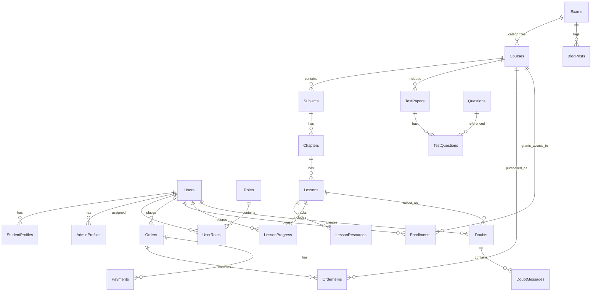

# 17 - New Database Architecture (Microsoft SQL Server & EF Core)

## 1. Relational Schema Design & Normalization
The new database architecture uses Microsoft SQL Server with Entity Framework Core Code-First migrations. It standardizes naming conventions (`PascalCase`), establishes primary/foreign key relational constraints, indexes query paths, supports soft-deletes (`IsDeleted`), and enforces audit timestamps (`CreatedAtUtc`, `UpdatedAtUtc`).

---

## 2. Core Entity Tables Definition

### 2.1 Identity, Users & Roles
- **`Users`**: `Id` (Guid, PK), `FullName`, `Email` (Unique Index), `PhoneNumber`, `PasswordHash`, `IsEmailVerified`, `IsActive`, `CreatedAtUtc`, `UpdatedAtUtc`.
- **`Roles`**: `Id` (Int, PK), `Name` (SuperAdmin, Admin, CourseManager, ContentManager, Mentor, Student).
- **`UserRoles`**: `UserId` (FK), `RoleId` (FK).
- **`StudentProfiles`**: `UserId` (FK, PK), `TargetExam`, `TargetYear`, `Bio`, `AvatarUrl`.
- **`FacultyProfiles`**: `Id` (Int, PK), `FullName`, `Designation`, `Bio`, `PhotoUrl`, `CollegeDetails`.

### 2.2 Academic & Curriculum Core
- **`Exams`**: `Id` (Int, PK), `Name`, `Slug` (Unique Index), `Description`, `IconUrl`, `SortOrder`, `IsActive`.
- **`Courses`**: `Id` (Int, PK), `ExamId` (FK), `Title`, `Slug` (Unique Index), `ShortDescription`, `FullDescriptionHtml`, `Price`, `DiscountedPrice`, `DiscountPercent`, `ExpiryDate`, `ThumbnailUrl`, `BannerUrl`, `TrailerVimeoId`, `IsFeatured`, `IsMentorship`, `IsTestSeries`, `IsPublished`, `SortOrder`.
- **`Subjects`**: `Id` (Int, PK), `CourseId` (FK), `Name`, `Code`, `SortOrder`.
- **`Chapters`**: `Id` (Int, PK), `SubjectId` (FK), `Name`, `Description`, `SortOrder`.
- **`Lessons`**: `Id` (Int, PK), `ChapterId` (FK), `Title`, `LessonType` (Video, Document, Quiz, Live), `VimeoVideoId`, `DocumentUrl`, `DurationSeconds`, `IsFreePreview`, `SortOrder`.
- **`CourseFaqs`**: `Id` (Int, PK), `CourseId` (FK), `Question`, `AnswerHtml`, `SortOrder`.

### 2.3 Assessment Engine
- **`Questions`**: `Id` (Int, PK), `SubjectId` (FK), `ChapterId` (FK), `QuestionType` (MCQ, Numerical), `QuestionTextHtml`, `OptionA`, `OptionB`, `OptionC`, `OptionD`, `CorrectOption`, `NumericalAnswer`, `NumericalTolerance`, `Difficulty` (Easy, Medium, Hard), `ExplanationHtml`.
- **`TestPapers`**: `Id` (Int, PK), `CourseId` (FK), `Title`, `DurationMinutes`, `TotalMarks`, `MarksPerCorrect`, `NegativeMarks`, `TotalQuestions`, `InstructionsHtml`, `IsActive`.
- **`TestPaperQuestions`**: `Id` (Int, PK), `TestPaperId` (FK), `QuestionId` (FK), `SectionName`, `SortOrder`, `IsBonus`.
- **`TestAttempts`**: `Id` (Guid, PK), `TestPaperId` (FK), `UserId` (FK), `StartTime`, `EndTime`, `Score`, `Status`.
- **`TestAttemptDetails`**: `Id` (Guid, PK), `TestAttemptId` (FK), `QuestionId` (FK), `SelectedOption`, `GivenNumericalAnswer`, `IsCorrect`, `TimeSpentSeconds`, `IsBookmarked`.

### 2.4 E-Commerce, PayU & Invoicing
- **`Coupons`**: `Id` (Int, PK), `Code` (Unique Index), `DiscountType` (Percentage, Flat), `DiscountAmount`, `MinOrderAmount`, `MaxDiscountAmount`, `ValidFromUtc`, `ExpiresAtUtc`, `UsageLimit`, `UsedCount`, `IsActive`.
- **`Orders`**: `Id` (Guid, PK), `OrderNumber` (Unique Index), `UserId` (FK), `GrossAmount`, `DiscountAmount`, `TaxableAmount`, `GstAmount`, `NetAmount`, `CouponId` (Nullable FK), `Status` (Pending, Success, Failed, Cancelled), `CreatedAtUtc`.
- **`OrderItems`**: `Id` (Int, PK), `OrderId` (FK), `CourseId` (FK), `Price`, `DiscountAmount`, `NetAmount`.
- **`Payments`**: `Id` (Guid, PK), `OrderId` (FK), `Gateway` (PayU), `GatewayTransactionId` (`mihpayid`), `MerchantTxnId`, `Amount`, `Status` (Pending, Success, Failed), `RawCallbackJson`, `VerifiedAtUtc`.
- **`Enrollments`**: `Id` (Int, PK), `UserId` (FK), `CourseId` (FK), `OrderId` (FK), `GrantedAtUtc`, `ExpiresAtUtc`, `IsActive`.

### 2.5 Doubts, Blogs, CMS & Media
- **`Doubts`**: `Id` (Int, PK), `UserId` (FK), `LessonId` (Nullable FK), `QuestionId` (Nullable FK), `Title`, `Content`, `AttachmentUrl`, `Status` (Open, InReview, Answered, Closed), `CreatedAtUtc`.
- **`DoubtMessages`**: `Id` (Int, PK), `DoubtId` (FK), `SenderUserId` (FK), `MessageHtml`, `AttachmentUrl`, `CreatedAtUtc`.
- **`BlogPosts`**: `Id` (Int, PK), `ExamId` (Nullable FK), `Title`, `Slug` (Unique Index), `ContentHtml`, `Excerpt`, `FeaturedImageUrl`, `AltText`, `AuthorId` (FK), `Status` (Draft, Scheduled, Published), `PublishedAtUtc`, `CreatedAtUtc`, `UpdatedAtUtc`.
- **`BlogCategories`** & **`BlogTags`**: Normalized categorization entities.
- **`SeoMetadata`**: `Id` (Int, PK), `EntityType` (Page, Exam, Course, Blog), `EntityId` (Int), `Path`, `Title`, `Description`, `CanonicalUrl`, `Robots`, `OgTitle`, `OgDescription`, `OgImageUrl`, `TwitterCardType`.
- **`RedirectRules`**: `Id` (Int, PK), `SourcePath` (Unique Index), `TargetPath`, `StatusCode` (301, 302), `IsActive`.
