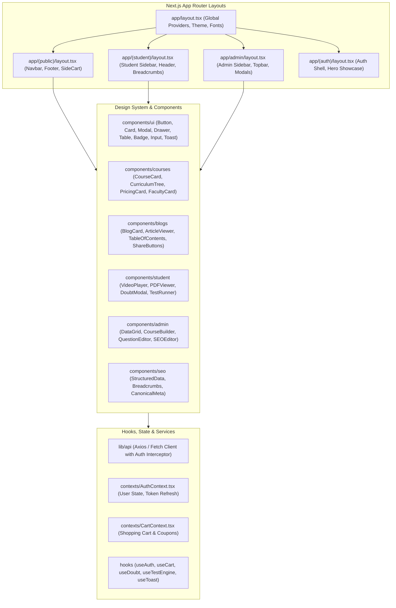

# 19 - Frontend Architecture (Next.js App Router & TypeScript)

## 1. Frontend Architectural Overview
The frontend is constructed using Next.js (App Router), React, TypeScript, and Tailwind CSS. It leverages React Server Components (RSC) for marketing and content pages to achieve fast Core Web Vitals and SEO discoverability, paired with React Client Components for interactive student and admin applications.



---

## 2. Directory & Component Organization
```text
frontend/
├── app/
│   ├── (public)/
│   │   ├── page.tsx                           (Home)
│   │   ├── about/page.tsx                     (About Us)
│   │   ├── contact/page.tsx                   (Contact Us)
│   │   ├── course-all/page.tsx                (Course Catalog)
│   │   ├── course-detail/[slug]/page.tsx      (Course Landing)
│   │   ├── exam/[slug]/page.tsx               (Exam Hub)
│   │   ├── mentorship/[slug]/page.tsx         (Mentorship Landing)
│   │   ├── testseries/[slug]/page.tsx         (Test Series Landing)
│   │   ├── blog/page.tsx                      (Blog Hub)
│   │   ├── blog-detail/[slug]/page.tsx        (Article Detail)
│   │   ├── cart/page.tsx                      (Cart)
│   │   └── checkout/page.tsx                  (Checkout)
│   ├── (auth)/
│   │   ├── login/page.tsx                     (Login)
│   │   ├── register/page.tsx                  (Registration)
│   │   ├── forgot-password/page.tsx           (Password Reset)
│   │   └── verifymail/[code]/page.tsx         (Email Verification)
│   ├── (student)/
│   │   ├── student/dashboard/page.tsx         (Student Dashboard)
│   │   ├── student/courses/page.tsx           (My Courses)
│   │   ├── student/courses/[id]/page.tsx      (Classroom Hub)
│   │   ├── student/doubts/page.tsx            (Doubts)
│   │   ├── student/tests/[id]/page.tsx        (Test Engine)
│   │   └── student/invoices/page.tsx          (Invoices)
│   ├── admin/
│   │   ├── dashboard/page.tsx                 (Admin Dashboard)
│   │   ├── courses/page.tsx                   (Course CMS)
│   │   ├── questions/page.tsx                 (Question Bank)
│   │   ├── blogs/page.tsx                     (Blog CMS)
│   │   ├── doubts/page.tsx                    (Doubt Resolution)
│   │   └── seo/page.tsx                       (SEO Controls)
│   ├── sitemap.ts                             (Dynamic XML Sitemap)
│   ├── robots.ts                              (Dynamic Robots.txt)
│   ├── layout.tsx                             (Root Layout)
│   └── not-found.tsx                          (404 Page)
├── components/
│   ├── ui/
│   ├── layout/
│   ├── courses/
│   ├── blogs/
│   ├── student/
│   ├── admin/
│   └── seo/
├── lib/
├── services/
├── hooks/
├── types/
└── styles/
```
