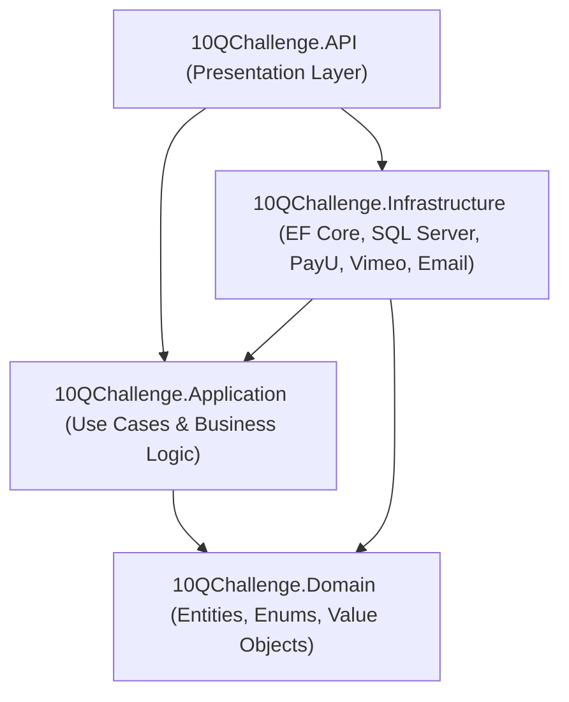

# 20 - Backend Architecture (ASP.NET Core Web API & Clean Architecture)

## 1. Clean Architecture Layers
The backend solution is organized following Clean Architecture principles to ensure complete separation of concerns, testability, and scalability.

---

## 2. Project Structure & Responsibilities

### 2.1 `10QChallenge.Domain`
- **Pure Core Entities**: `Course`, `Subject`, `Chapter`, `Lesson`, `Exam`, `Question`, `TestPaper`, `TestAttempt`, `BlogPost`, `Order`, `Payment`, `Enrollment`, `Doubt`, `User`, `Role`.
- **Enums & Domain Exceptions**: `PaymentStatus`, `OrderStatus`, `DoubtStatus`, `QuestionType`, `DifficultyLevel`.

### 2.2 `10QChallenge.Application`
- **Interfaces**: `IApplicationDbContext`, `IPayUService`, `IVimeoService`, `IEmailService`, `IJwtTokenGenerator`, `ICurrentUserService`.
- **DTOs & ViewModels**: Request and response contracts for all endpoints.
- **Validation**: FluentValidation rules for commands and input sanitization.
- **Service Handlers**: Business logic implementations for enrollment verification, test scoring, coupon calculations, and checkout.

### 2.3 `10QChallenge.Infrastructure`
- **Database Context**: `ApplicationDbContext` with EF Core entity configurations, indexes, and soft-delete filters.
- **Payment Gateway**: `PayUService` implementing SHA-512 hash generation and response verification.
- **Identity & Security**: `PasswordHasher` using PBKDF2 / BCrypt, `JwtTokenGenerator` using asymmetric/HMAC SHA-256 with environment secret keys.
- **Email & Notification**: `SendGridEmailService` or `SmtpEmailService`.

### 2.4 `10QChallenge.API`
- **Controllers**: `AuthController`, `CoursesController`, `ExamsController`, `BlogsController`, `CheckoutController`, `PaymentsController`, `StudentController`, `AdminController`, `SeoController`.
- **Middleware**: Global Exception Handling, JWT Authentication & Authorization, Rate Limiting, Request Logging with Serilog.
