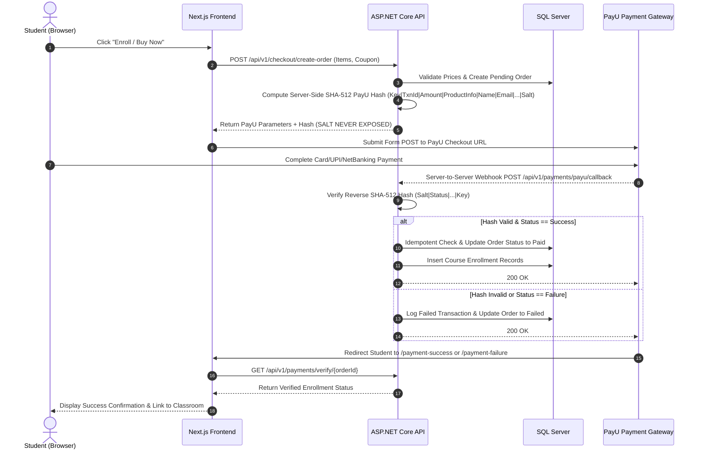

# 21 - PayU Payment Gateway Architecture & Security Protocol

## 1. PayU Integration Workflow & Security



---

## 2. Cryptographic Hash Calculation Specifications

### 2.1 Forward Payment Request Hash (Outbound)
```text
Formula:
SHA512(key|txnid|amount|productinfo|firstname|email|udf1|udf2|udf3|udf4|udf5||||||salt)
```
- **Strict Rule**: Calculated strictly on backend ASP.NET Core server. Merchant Salt (`PAYU_MERCHANT_SALT`) is NEVER sent to frontend.

### 2.2 Reverse Callback Verification Hash (Inbound)
```text
Formula:
SHA512(salt|status||||||udf5|udf4|udf3|udf2|udf1|email|firstname|productinfo|amount|txnid|key)
```
- **Strict Rule**: Verified before any database state transition or enrollment activation.

---

## 3. Idempotency & Edge Case Resilience
1. **Duplicate Webhooks**: Database queries verify if `Order.Status == OrderStatus.Paid`. If already paid, the callback returns 200 OK without re-inserting duplicate enrollments.
2. **Amount Mismatch Detection**: The callback `amount` is strictly compared with `Order.NetAmount`. If mismatched, the transaction is flagged for fraud and rejected.
3. **Network Failure on Return**: Even if the student closes their browser before redirection, the backend server-to-server webhook guarantees enrollment activation.
