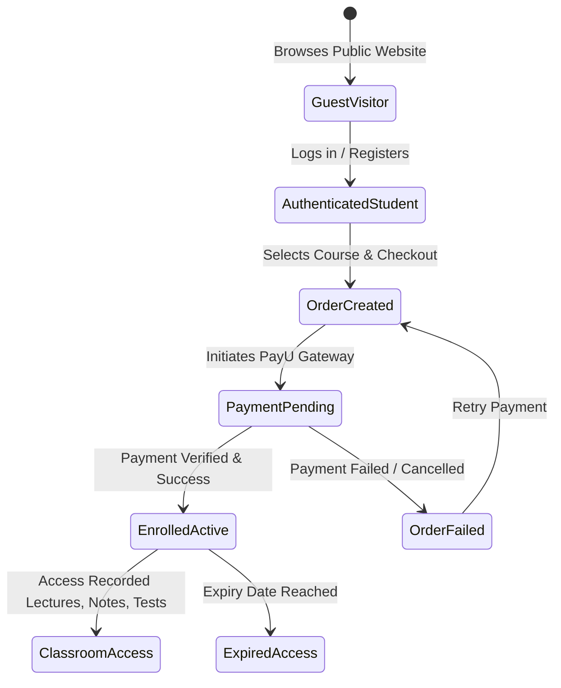

# 22 - End-to-End Enrollment & Access Control Flow

## 1. Access Control Matrix & State Machine

---

## 2. Server-Side Enrollment Enforcement Rule
1. **Zero Client Trust**: Course video IDs, PDF URLs, and test questions are NEVER returned to un-enrolled students.
2. **Endpoint Validation**: Every request to `/api/v1/student/lessons/{lessonId}` or `/api/v1/student/tests/{paperId}` verifies that the authenticated `UserId` possesses an active, unexpired record in the `Enrollments` table matching the course.
3. **Free Preview Support**: If `Lesson.IsFreePreview == true`, the endpoint serves the preview video without requiring an enrollment record.
