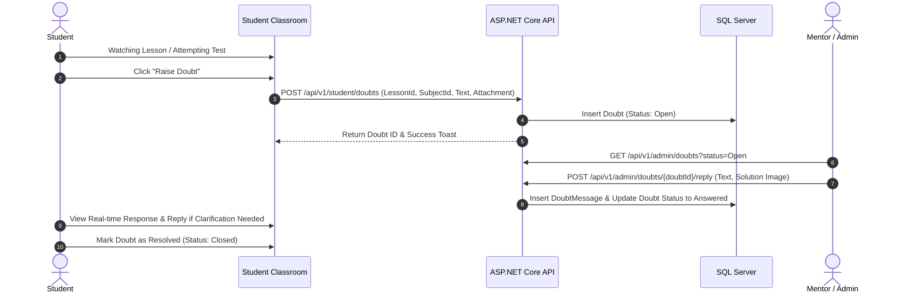

# 23 - Doubt Clearance System Architecture

## 1. Doubt Resolution Workflow

---

## 2. Feature Capabilities
- **Contextual Attachment**: Automatically captures the exact Course, Subject, Chapter, and Lesson (or Question ID) where the student initiated the query.
- **Rich Media**: Supports Markdown text, mathematical equations, and screenshot/PDF upload attachments.
- **Admin Filtering**: Instructors can filter doubts by Subject (Physics, Chemistry, Math), Course, Urgency, and Status (Open, In Review, Answered, Closed).
