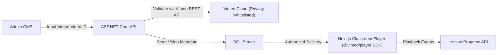

# 24 - Vimeo Video Architecture & Streaming Integration

## 1. Video Delivery & Security Principles
- **Privacy & Domain Whitelisting**: All educational lecture videos hosted on Vimeo PRO / Business are restricted to playback exclusively on `10qchallenge.in` and `localhost` (development).
- **No Token Exposure**: Vimeo API Private Access Tokens are kept strictly in backend environment variables and never leaked in client bundle JavaScript.
- **Lazy Video Loading**: Video players are not instantiated until a student actively selects and opens a lesson, eliminating unnecessary iframe overhead and boosting page performance.
- **Player Customization**: Clean, distraction-free player UI removing extraneous branding, related videos, and social share links.

---

## 2. Dynamic Vimeo Integration Component
The Next.js frontend uses an optimized Vimeo Player component:
- Dynamically loads `@vimeo/player` SDK.
- Listens to `play`, `pause`, `timeupdate`, and `ended` events.
- Dispatches automated progress calls when video playback surpasses 85% completion.
