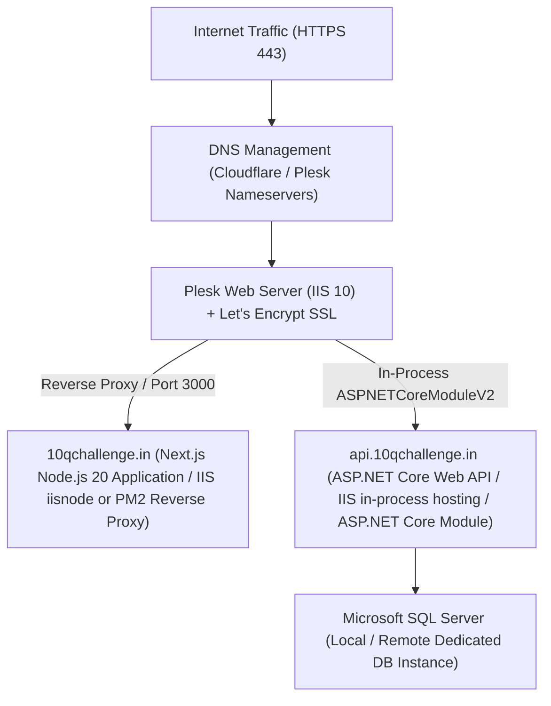

# 25 - Plesk Hosting & Production Deployment Architecture

## 1. Hosting Environment & Infrastructure Strategy
The application will be hosted on a Plesk-managed Windows Server environment with IIS reverse proxy capabilities.

---

## 2. Deployment Blueprint

### 2.1 Frontend: `10qchallenge.in`
- **Engine**: Node.js 20 LTS via Plesk Node.js extension or PM2 process manager running Next.js standalone server (`output: 'standalone'`).
- **Port Mapping**: Next.js server listens on `127.0.0.1:3000`, with Plesk IIS reverse proxy forwarding `https://10qchallenge.in` traffic.
- **Environment Variables**:
  - `NEXT_PUBLIC_API_URL=https://api.10qchallenge.in/api/v1`
  - `NEXT_PUBLIC_SITE_URL=https://10qchallenge.in`
  - `NEXTAUTH_SECRET=...`

### 2.2 Backend: `api.10qchallenge.in`
- **Engine**: ASP.NET Core 8.0 Web API hosted directly in IIS using `AspNetCoreModuleV2`.
- **Application Pool**: CLR Version `No Managed Code`, Pipeline Mode `Integrated`.
- **Environment Configuration**: Set via `appsettings.Production.json` or Plesk IIS Configuration Editor:
  - `ConnectionStrings:DefaultConnection`: SQL Server connection string with encrypted credentials.
  - `PayU:MerchantKey`, `PayU:MerchantSalt`, `PayU:BaseUrl`.
  - `Jwt:SecretKey`, `Jwt:Issuer`, `Jwt:Audience`.
  - `Cors:AllowedOrigins`: `https://10qchallenge.in`.
