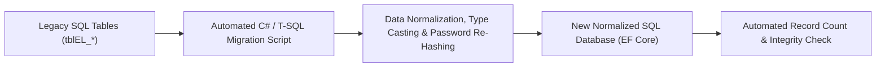

# 26 - Complete Data Migration & Schema ETL Plan

## 1. Migration Protocol & Verification Matrix
To ensure zero data loss during the transition from the legacy database (`tblEL_*`) to the new normalized schema, a structured ETL (Extract, Transform, Load) script will execute in sequence.

---

## 2. Table-by-Table Migration Mapping

| Legacy Entity (`tblEL_*`) | New Entity | Key Transformations & Field Mappings | Migration Rule |
|---|---|---|---|
| `tblEL_MasterExam` | `Exams` | `ExamName` -> `Name`, `ExamSlug` -> `Slug`, `ExamDescription` -> `Description` | Preserve all slugs exactly |
| `tblEL_MasterSubject` | `Subjects` | `SubjectName` -> `Name`, `SubjectCode` -> `Code` | Migrate all active records |
| `tblEL_MasterChapter` | `Chapters` | `ChapterName` -> `Name`, `ChapterBriefDescription` -> `Description`, `IndexNumber` -> `SortOrder` | Maintain foreign keys |
| `tblEL_MasterChapterTopic` | `ChapterTopics` | `TopicName` -> `Name`, `OrderNumber` -> `SortOrder` | Maintain hierarchy |
| `tblEL_MasterCourse` | `Courses` | `CourseTitle` -> `Title`, `CourseSlug` -> `Slug`, `CourseShortDescription` -> `ShortDescription`, `CourseOriginalPrice` -> `Price`, `CourseDiscountedPrice` -> `DiscountedPrice` | **Critical**: Preserve all course slugs |
| `tblEL_MasterCourseFAQ` | `CourseFaqs` | `FAQuestion` -> `Question`, `FAAnswer` -> `AnswerHtml` | Migrate all active FAQs |
| `tblEL_MasterVideo` | `Lessons` | `VideoTitle` -> `Title`, `VideoLink` -> `VimeoVideoId`, `LessonType` = 'Video' | Extract clean Vimeo ID |
| `tblEL_MasterDocument` | `Lessons` | `DocumentTitle` -> `Title`, `DocumentLink` -> `DocumentUrl`, `LessonType` = 'Document' | Standardize PDF paths |
| `tblEL_MasterQuestion` | `Questions` | `QuestionText` -> `QuestionTextHtml`, `Answer1..4` -> `Options`, `NumericalAnswer` | Preserve math markup |
| `tblEL_ExamPaperMain` | `TestPapers` | `ExamPaperName` -> `Title`, `TimeDuration` -> `DurationMinutes`, `MarksPerCorrectAnswer` | Map to Courses |
| `tblEL_MasterStudent` | `Users` & `StudentProfiles` | `FullName`, `EmailID` -> `Email`, `MobileNumber` -> `PhoneNumber`, `IsEmailVerified` | Seamless student login |
| `tblEL_InvoiceMain` | `Orders` | `InvoiceNumber` -> `OrderNumber`, `TotalNetAmount` -> `NetAmount`, `InvoiceDate` -> `CreatedAtUtc` | Preserve historical sales |
| `tblEL_InvoiceDetail` | `OrderItems` | `CourseMRP` -> `Price`, `CourseNetAmount` -> `NetAmount` | Link to Orders & Courses |
| `tblEL_LinkStudent_Course` | `Enrollments` | `MasterStudentID` -> `UserId`, `MasterCourseID` -> `CourseId` | **Critical**: Retain active student enrollments |
| `tblEL_MasterBlog` | `BlogPosts` | `BlogTitle` -> `Title`, `BlogSlug` -> `Slug`, `BlogDescription` -> `ContentHtml`, `PublishedDate` | **100% Blog Fidelity Guarantee** |
| `tblEL_MasterCoupon` | `Coupons` | `CouponCode` -> `Code`, `DiscountValue` -> `DiscountAmount`, `ExpiryDate` | Preserve active codes |
| `tblEL_SEOPage` | `SeoMetadata` | `PageName` -> `Path`, `PageMetaTag` -> `Title`, `PageMetaDescription` -> `Description` | Migrate all metadata |
| `tblEL_Doubt` | `Doubts` | `DoubtText` -> `Content`, `DoubtStatus` -> `Status`, `EntryDate` -> `CreatedAtUtc` | Preserve open tickets |
