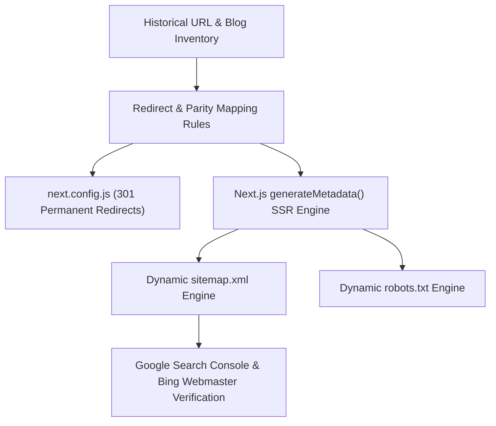

# 27 - SEO Migration, URL Preservation & Validation Plan

## 1. Zero-Loss SEO Strategy
1. **URL Parity**: All public URLs (`/`, `/about`, `/contact`, `/blog`, `/blog-detail/[slug]`, `/exam/[slug]`, `/course-all`, `/course-detail/[slug]`) remain unchanged.
2. **Metadata Retention**: Legacy meta titles and descriptions migrated into the new `SeoMetadata` table and served dynamically via Next.js SSR.
3. **Structured Data Upgrade**: Adding Schema.org JSON-LD structured data for `Organization`, `WebSite`, `Course`, `Article`, `BreadcrumbList`, and `FAQPage`.

---

## 2. Validation & Quality Assurance Protocol
Before and immediately following DNS cutover:
- **Crawl & Status Code Audit**: Run automated crawler over 100% of historical URLs to confirm:
  - 0 Broken 404 links on historical URLs.
  - 0 Internal 500 server errors.
  - 0 Redirect chains (All redirects are single-hop 301).
- **Canonical Consistency Check**: Verify that `<link rel="canonical">` points to the exact canonical destination with `https://10qchallenge.in`.
- **Schema Validation**: Verify with Google Rich Results Test for `Article`, `Course`, and `BreadcrumbList`.
