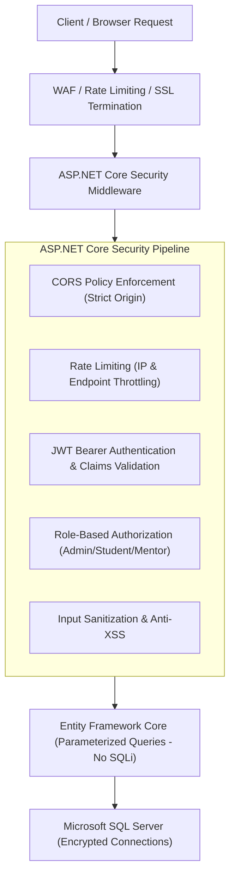

# 29 - Enterprise Security Plan & Compliance Architecture

## 1. Threat Mitigation & Security Controls

---

## 2. Core Security Implementation Standards
1. **Secrets Management**:
   - Zero hardcoded credentials in source code.
   - PayU keys/salts, Vimeo private tokens, and JWT signing keys stored strictly in server-side environment variables or Azure Key Vault / Plesk protected configuration.
2. **Authentication & Password Hashing**:
   - Password hashing with **PBKDF2 with SHA-512** (100,000 iterations) or **BCrypt** with unique cryptographic salts.
   - JWT tokens signed using HMAC-SHA256 (256-bit+ secure key) with short expiration (15 minutes) and HTTP-only, Secure, SameSite refresh tokens.
3. **Authorization & Access Control**:
   - Every student content endpoint verifies enrollment server-side.
   - Admin controllers protected by `[Authorize(Roles = "SuperAdmin,Admin")]`.
4. **Injection & XSS Protection**:
   - 100% Parameterized EF Core queries completely eliminate SQL Injection.
   - All rich text inputs sanitized using `HtmlSanitizer` to prevent Cross-Site Scripting (XSS).
   - Content Security Policy (CSP) headers enabled in Next.js.
5. **Secure Payment Validation**:
   - Cryptographic PayU SHA-512 hash validation on both payment initiation and webhook return.
