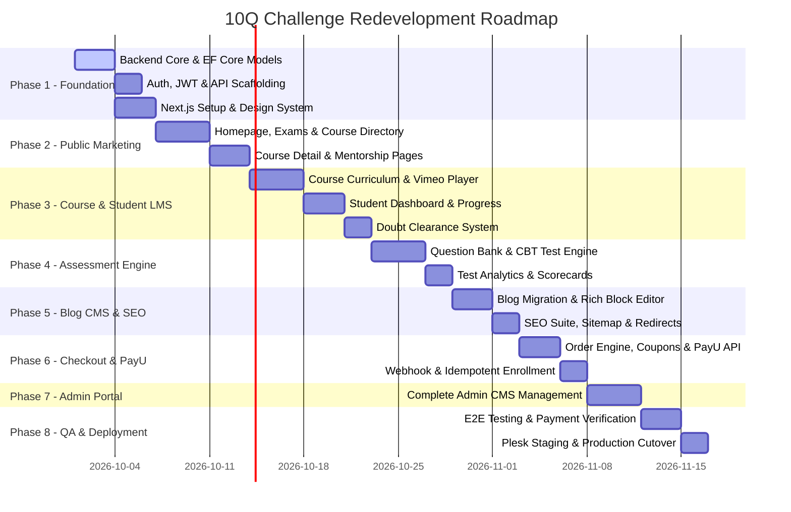

# 31 - Complete Implementation Roadmap & Phase-by-Phase Plan

## 1. Phased Execution Roadmap

---

## 2. Phase-by-Phase Breakdown

### Phase 1: Foundation & Project Setup
- Setup clean Clean Architecture ASP.NET Core Web API solution (`10QChallenge.API`, `Application`, `Domain`, `Infrastructure`).
- Setup Microsoft SQL Server with EF Core code-first migrations.
- Setup Next.js App Router project with Tailwind CSS and the custom 10Q Challenge Design System.
- Implement robust JWT Authentication with secure refresh token cookies.

### Phase 2: Public Website & Marketing Pages
- Implement high-performance Homepage with dynamic Hero, exam tabs, course cards, and testimonial carousels.
- Implement Exam Landing Hubs (`/exam/[slug]`), Mentorship Hubs (`/mentorship/[slug]`), and Test Series Hubs (`/testseries/[slug]`).
- Implement high-converting Course Detail page (`/course-detail/[slug]`) with modular marketing blocks and FAQ schema.
- Implement About Us, Contact Us, Cart, and Checkout pages.

### Phase 3: Course Curriculum & Student Learning Portal
- Implement Curriculum Engine (Subjects -> Chapters -> Lessons).
- Integrate Vimeo streaming player with domain whitelisting and lazy initialization.
- Implement Student Dashboard (`/student/dashboard`) with "Continue Learning" and real-time progress indicators.
- Implement Contextual Doubt System (`/student/doubts`).

### Phase 4: Assessment & Computer-Based Test (CBT) Engine
- Implement Question Bank CMS (MCQ and Numerical with LaTeX formula support).
- Build timed CBT Test Engine with question palette, instant autosave, and countdown timer.
- Build Post-Test Analytics with scorecards, percentiles, and solutions.

### Phase 5: Blog CMS & SEO Engine
- Execute 100% Blog Content & Media Migration from legacy `tblEL_MasterBlog`.
- Build Rich Block Editor with image uploads and publishing scheduling.
- Implement dynamic SEO metadata, XML sitemap generation (`app/sitemap.ts`), dynamic `robots.txt`, and 301 redirect engine.

### Phase 6: E-Commerce & PayU Payment Gateway
- Implement cart management and coupon discount engine.
- Implement PayU SHA-512 payment initiation and webhook callback verification.
- Implement automated enrollment activation upon payment success.

### Phase 7: Administrative Operations CMS
- Build modern SaaS Admin Portal (`/admin/*`) with course builder, question editor, blog manager, doubt moderation console, and order audit log.

### Phase 8: Quality Assurance, Security Audit & Plesk Deployment
- Execute full test suite (Unit, Integration, PayU Sandbox test cases, URL validation).
- Deploy to Plesk production environment with Let's Encrypt SSL and IIS reverse proxy configuration.
- Execute final data verification and production launch.
