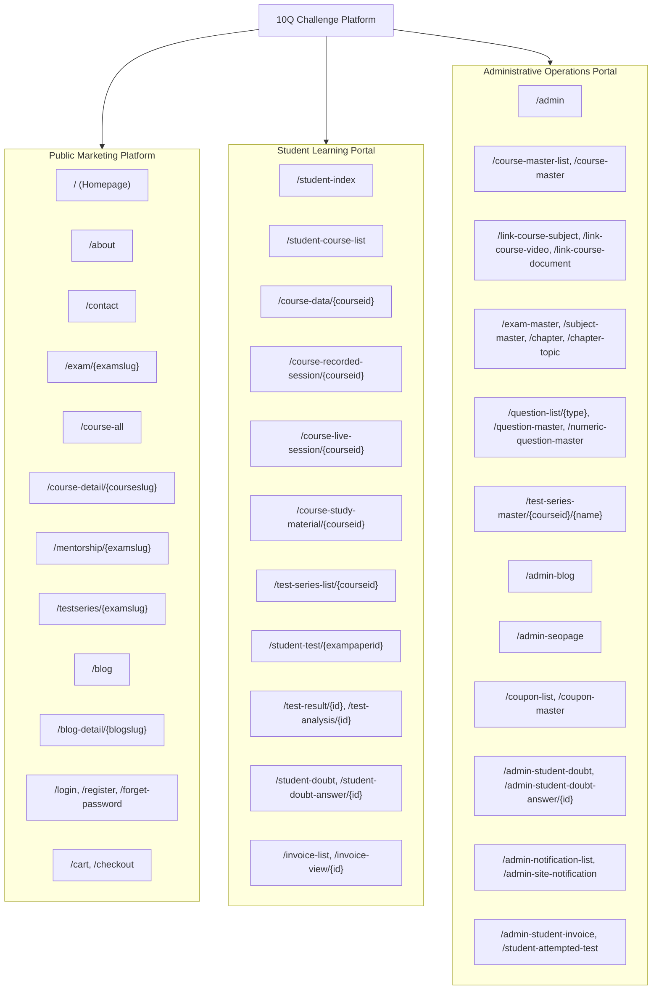

# 03 - Old Site Structure & Navigation Architecture

## 1. High-Level Site Hierarchy

---

## 2. Navigation Menus & User Journeys

### 2.1 Public Header Navigation
- **Logo**: Links to `/`
- **Exams Dropdown**: Dynamically populated via ViewComponent / API (`BITSAT`, `JEE`, `COMEDK`, `MET`, `VITEEE`)
- **Courses**: Links to `/course-all`
- **Mentorship**: Links to `/mentorship/{examslug}`
- **Test Series**: Links to `/testseries/{examslug}`
- **Blog**: Links to `/blog`
- **About Us**: Links to `/about`
- **Contact Us**: Links to `/contact`
- **Cart Icon**: Side cart modal / drawer displaying active items
- **Auth Actions**: Login (`/login`) / Sign Up (`/register`) or Student Dashboard (`/student-index`)

### 2.2 Student Sidebar Navigation
1. **Dashboard** (`/student-index`): Quick statistics, enrolled courses, continue learning, notifications.
2. **My Courses** (`/student-course-list`): List of active enrolled courses.
3. **Course Room**:
   - Recorded Lectures (`/course-recorded-session/{id}`)
   - Live Sessions (`/course-live-session/{id}`)
   - Study Material & Notes (`/course-study-material/{id}`)
   - Test Series (`/test-series-list/{id}`)
4. **Test Performance**:
   - Attempted Tests (`/attempted-test`)
   - Test Analytics (`/test-analysis/{id}`)
   - Bookmarked Questions (`/bookmark-question`)
5. **Doubt Clearance**:
   - My Doubts (`/student-doubt`)
   - Doubt Thread / Conversation (`/student-doubt-answer/{id}`)
6. **Billing & Invoices**:
   - Invoices (`/invoice-list`)
   - View Receipt (`/invoice-view/{id}`)

### 2.3 Admin Sidebar Navigation
1. **Dashboard** (`/admin`): High-level system stats.
2. **Curriculum Engine**:
   - Exams (`/exam-master`)
   - Subjects (`/subject-master`)
   - Chapters (`/chapter`, `/chapter-list`)
   - Topics (`/chapter-topic`)
   - Courses (`/course-master-list`, `/course-master`)
   - Course FAQs (`/course-faq/{id}/{name}`)
   - Course-Subject Linker (`/link-course-subject/{id}/{name}`)
   - Video Linker (`/link-course-video/{id}/{name}`)
   - Document Linker (`/link-course-document/{id}/{name}`)
3. **Assessment Engine**:
   - Question Bank (`/question-list/1`, `/question-list/2`)
   - MCQ Creator (`/question-master`)
   - Numerical Question Creator (`/numeric-question-master`)
   - Test Series Creator (`/test-series-master/{id}/{name}`)
   - Paper Question Linker (`/link-exampaper-question/{cid}/{eid}/{name}`)
4. **Media & Assets**:
   - Video Bank (`/video-master`)
   - Document Bank (`/document-master`)
5. **Marketing & Growth**:
   - Blog Posts (`/admin-blog`)
   - SEO Metadata (`/admin-seopage`)
   - Coupons (`/coupon-list`, `/coupon-master`)
   - Site Banners (`/admin-site-notification`)
   - Course Announcements (`/admin-notification-list`)
6. **Support & Operations**:
   - Student Doubts (`/admin-student-doubt`, `/admin-student-doubt-answer/{id}`)
   - Invoices & Sales (`/admin-student-invoice`)
   - Test Attempts (`/student-attempted-test`)
