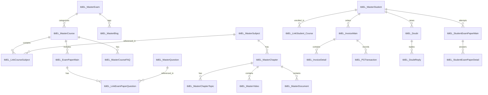

# 06 - Old Database Structure & Entity Analysis

## 1. Legacy Database Schema Overview
The legacy system operates on a Microsoft SQL Server database utilizing raw ADO.NET SQL commands without an ORM. All legacy tables adhere to the prefix `tblEL_*`.

---

## 2. Table Catalog & Column Breakdown

### 2.1 Curriculum & Academic Entities
1. **`tblEL_MasterExam`**:
   - Columns: `MasterExamID` (PK, Int), `ExamName` (VarChar), `ExamSlug` (VarChar), `ExamDescription` (VarChar), `ExamMetaTag` (VarChar), `ExamMetaDescription` (VarChar), `UserID` (Int).
2. **`tblEL_MasterSubject`**:
   - Columns: `MasterSubjectID` (PK, Int), `SubjectCode` (VarChar), `SubjectName` (VarChar), `IsActive` (Bit), `IsDeleted` (Bit).
3. **`tblEL_MasterChapter`**:
   - Columns: `MasterChapterID` (PK, Int), `MasterSubjectID` (FK, Int), `ChapterName` (VarChar), `ChapterBriefDescription` (VarChar), `IndexNumber` (Int), `IsActive` (Bit), `IsDeleted` (Bit).
4. **`tblEL_MasterChapterTopic`**:
   - Columns: `MasterChapterTopicID` (PK, Int), `MasterChapterID` (FK, Int), `TopicName` (VarChar), `TopicDescription` (VarChar), `OrderNumber` (Int), `IsActive` (Bit), `IsDeleted` (Bit).
5. **`tblEL_MasterCourse`**:
   - Columns: `MasterCourseID` (PK, Int), `MasterExamID` (FK, Int), `CourseTitle` (VarChar), `CourseSlug` (VarChar), `CourseShortDescription` (VarChar), `CourseFullDescription` (VarChar), `CourseOriginalPrice` (Float), `CourseDiscountedPrice` (Float), `CourseDiscountedPercent` (Float), `ExpiryDate` (DateTime), `EnrolledStudent` (Int), `AdditionalDetails` (VarChar), `CourseImageName` (VarChar), `BannerImageName` (VarChar), `AltTagCourseImage` (VarChar), `AltTagBannerImage` (VarChar), `CourseIntroVideoLink` (VarChar), `CourseIntroductionLink` (VarChar), `DisplayIndex` (Int), `IsShowInIndex` (Bit), `IsShowInMentorship` (Bit), `IsShowInTestSeries` (Bit), `IsCourseActive` (Bit), `CourseMetaTag` (VarChar), `CourseMetaDescription` (VarChar).
6. **`tblEL_MasterCourseFAQ`**:
   - Columns: `MasterCourseFAQID` (PK, Int), `MasterCourseID` (FK, Int), `DisplayIndex` (Int), `FAQuestion` (VarChar), `FAAnswer` (VarChar), `IsDeleted` (Bit).
7. **`tblEL_LinkCourseSubject`**:
   - Columns: `LinkCourseSubjectID` (PK, Int), `MasterCourseID` (FK, Int), `MasterSubjectID` (FK, Int), `OrderNumber` (Int).
8. **`tblEL_MasterVideo`**:
   - Columns: `MasterVideoID` (PK, Int), `MasterSubjectID` (FK, Int), `MasterChapterID` (FK, Int), `MasterChapterTopicID` (FK, Int), `VideoTitle` (VarChar), `VideoBriefDescription` (VarChar), `VideoLink` (VarChar - Vimeo embed URL), `VideoOrderNumber` (Int), `IsLiveVideo` (Bit), `IsEnabled` (Bit), `IsDeleted` (Bit).
9. **`tblEL_MasterDocument`**:
   - Columns: `MasterDocumentID` (PK, Int), `MasterSubjectID` (FK, Int), `MasterChapterID` (FK, Int), `MasterChapterTopicID` (FK, Int), `DocumentTitle` (VarChar), `DocumentBriefDescription` (VarChar), `DocumentLink` (VarChar - PDF path), `DocumentOrderNumber` (Int), `IsEnabled` (Bit), `IsDeleted` (Bit).
10. **`tblEL_LinkCourseVideo`** & **`tblEL_LinkCourseDocument`**:
    - Associative bridge tables mapping videos and documents to specific course modules.

### 2.2 Assessment & Question Bank
11. **`tblEL_MasterQuestion`**:
    - Columns: `MasterQuestionID` (PK, Int), `MasterSubjectID` (FK, Int), `MasterChapterID` (FK, Int), `QuestionType` (Int - 1: Single Choice MCQ, 2: Numerical), `QuestionText` (NVarChar(MAX)), `Answer1`, `Answer2`, `Answer3`, `Answer4` (NVarChar(MAX)), `IsCorrectAnswer1`, `IsCorrectAnswer2`, `IsCorrectAnswer3`, `IsCorrectAnswer4` (Bit), `NumericalAnswer` (Float), `NumericalTolerance` (Float), `ToughLevel` (Int: 1=Low, 2=Medium, 3=High), `QuestionExplanation` (NVarChar(MAX)).
12. **`tblEL_ExamPaperMain`**:
    - Columns: `ExamPaperMainID` (PK, Int), `MasterCourseID` (FK, Int), `ExamPaperName` (VarChar), `TotalQuestions` (Int), `TotalQuestionsAdded` (Int), `BonusQuestions` (Int), `MarksPerCorrectAnswer` (Float), `MarksPerWrongAnswer` (Float), `TimeDuration` (Int - minutes), `Description` (VarChar), `ExamInstructionHeader` (VarChar), `ExamInstructionFooter` (VarChar), `OrderNumber` (Int), `IsFreeTest` (Bit), `IsActive` (Bit), `EntryDate` (DateTime).
13. **`tblEL_LinkExamPaperQuestion`**:
    - Columns: `LinkExamPaperQuestionID` (PK, Int), `ExamPaperMainID` (FK, Int), `MasterQuestionID` (FK, Int), `SortIndex` (Int), `IsBonusQuestion` (Bit).
14. **`tblEL_StudentExamPaperMain`**:
    - Columns: `StudentExamPaperMainID` (PK, VarChar(36)/Guid), `ExamPaperMainID` (FK, Int), `MasterStudentID` (FK, Int), `ExamStartDate` (DateTime), `ExamEndDate` (DateTime), `TotalObtainedMarks` (Float), `Status` (Int).
15. **`tblEL_StudentExamPaperDetail`**:
    - Columns: `StudentExamPaperDetailID` (PK, VarChar), `StudentExamPaperMainID` (FK, VarChar(36)), `QNo` (Int), `MasterQuestionID` (FK, Int), `IsAttempted` (Bit), `IsCorrectAnswerGiven` (Int: 1=Correct, -1=Wrong, 0=Unattempted), `AnswerGiven` (VarChar), `IsBookmarked` (Bit).

### 2.3 Users, Invoicing, Payments & Enrollments
16. **`tblEL_MasterStudent`**:
    - Columns: `MasterStudentID` (PK, Int), `FullName` (VarChar(50)), `EmailID` (VarChar(50)), `MobileNumber` (VarChar(15)), `UserPassword` (VarChar(100)), `EmailOTP` (Int), `MobileOTP` (Int), `IsEmailVerified` (Bit), `IsMobileVerified` (Bit), `ReferralCode` (VarChar(20)), `IsActive` (Bit), `MailVerifyCode` (VarChar(50)), `TokenKey` (VarChar(36)/Guid), `OldPassword` (VarChar(100)).
17. **`tblEL_InvoiceMain`**:
    - Columns: `InvoiceMainID` (PK, Int), `PGTransactionID` (VarChar(36)), `MasterStudentID` (FK, Int), `InvoiceNumber` (Int), `InvoiceText` (VarChar(15)), `InvoiceDate` (DateTime), `MasterCouponID` (FK, Int), `TotalGrossAmount` (Float), `TotalDiscountAmount` (Float), `TotalTaxableAmount` (Float), `TotalTaxAmount` (Float), `TotalTaxAmountCGST` (Float), `RoundOffAmount` (Float), `TotalNetAmount` (Float), `InvoiceStatus` (VarChar(1): 's'=Success, 'f'=Failure, 'u'=Unknown).
18. **`tblEL_InvoiceDetail`**:
    - Columns: `InvoiceDetailID` (PK, Int), `InvoiceMainID` (FK, Int), `MasterCourseID` (FK, Int), `CourseMRP` (Float), `CourseGrossAmount` (Float), `CourseDiscountAmount` (Float), `CourseTaxableAmount` (Float), `TaxPercent` (Float), `CourseNetAmount` (Float).
19. **`tblEL_PGTransaction`**:
    - Columns: `PGTransactionID` (PK, VarChar(36)), `MasterStudentID` (FK, Int), `InvoiceNo` (VarChar(15)), `StudentName` (VarChar(50)), `EmailId` (VarChar(50)), `Mobile` (VarChar(15)), `GrandTotalAmount` (Float), `DiscountAmount` (Float), `NetAmount` (Float), `Status` (TinyInt: 0=Initiated, 1=Success, 2=Failure, 3=Other), `PG_TxnId` (VarChar(20)), `PG_Mode` (VarChar(10)), `PG_PaymentStatus` (VarChar(15)), `PG_UnmappedStatus` (VarChar(15)), `PG_Field9` (VarChar(50)), `PG_Type` (VarChar(20)), `PG_BankRefNum` (VarChar(20)), `PG_Error` (VarChar(10)), `PG_ErrorMessage` (VarChar(200)).
20. **`tblEL_LinkStudent_Course`**:
    - Columns: `LinkStudentCourseID` (PK, Int), `PGTransactionID` (VarChar(36)), `MasterStudentID` (FK, Int), `MasterCourseID` (FK, Int).
21. **`tblEL_LinkStudentStudy`**:
    - Columns: `LinkStudentStudyID` (PK, Int), `MasterStudentID` (FK, Int), `MasterDocumentID` / `MasterVideoID` (Int), `StudyDate` (DateTime).

### 2.4 Doubts, Blogs, CMS & Operations
22. **`tblEL_Doubt`**:
    - Columns: `DoubtID` (PK, Int), `MasterStudentID` (FK, Int), `StudentExamPaperDetailID` (VarChar), `MasterQuestionID` (Int), `MasterVideoID` (Int), `MasterDocumentID` (Int), `DoubtText` (VarChar(MAX)), `DoubtType` (VarChar(1): 'q'=Question, 'v'=Video, 'd'=Document), `DoubtStatus` (VarChar(1): 'o'=Open, 'c'=Closed), `DataLink` (VarChar), `EntryDate` (DateTime).
23. **`tblEL_DoubtReply`**:
    - Columns: `DoubtReplyID` (PK, VarChar(36)), `DoubtID` (FK, Int), `ReferenceID` (Int), `RepliedBy` (VarChar(50)), `ReplyText` (VarChar(MAX)), `EntryDate` (DateTime).
24. **`tblEL_MasterBlog`**:
    - Columns: `MasterBlogID` (PK, Int), `MasterExamID` (FK, Int), `BlogTitle` (VarChar(100)), `BlogDescription` (VarChar(MAX)), `BlogImagePath_Small` (VarChar(50)), `BlogImagePath_Large` (VarChar(50)), `AltTag_Description_Small` (VarChar(50)), `AltTag_Description_Large` (VarChar(50)), `BlogSlug` (VarChar(200)), `BlogMetaTag` (VarChar(200)), `BlogMetaDescription` (VarChar(300)), `PublishedDate` (DateTime), `PublishedBy` (Int), `IsPublished` (Bit), `EntryBy` (Int), `EntryDate` (DateTime), `UpdateBy` (Int), `UpdateDate` (DateTime).
25. **`tblEL_MasterCoupon`**:
    - Columns: `MasterCouponID` (PK, Int), `CouponCode` (VarChar(20)), `ValidFrom` (DateTime), `ExpiryDate` (DateTime), `CouponCourse` (Int: 0=All, >0=Specific), `DiscountType` (VarChar: 'p'=Percentage, 'f'=Flat), `DiscountValue` (Int), `TimesAllowed` (Int), `TimesUsed` (Int), `MasterCourseID` (Int), `IsEnabled` (Bit), `AdditionalDetails` (VarChar).
26. **`tblEL_SEOPage`**:
    - Columns: `SEOPageID` (PK, Int), `PageName` (VarChar(50)), `PageMetaTag` (VarChar(200)), `PageMetaDescription` (VarChar(300)), `UserID` (Int).
27. **`tblEL_SiteNotification`**:
    - Columns: `SiteNotificationID` (PK, Int), `SiteNotificationDescription` (VarChar(300)), `ShowFromDate` (DateTime), `ShowToDate` (DateTime).
28. **`tblEL_NotificationAdmin`**:
    - Columns: `NotificationAdminID` (PK, Int), `MasterCourseID` (Int), `NotificationTitle` (VarChar(100)), `NotificationDescription` (VarChar(500)), `FromDate` (DateTime), `ToDate` (DateTime), `NotificationType` (VarChar(20)).
